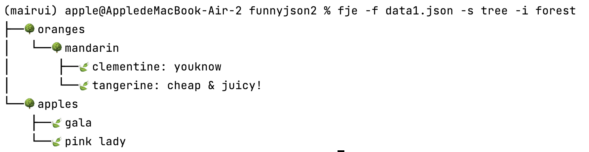

# Funny JSON Explorer 重构设计文档

## 引言 (Introduction)

Funny JSON Explorer (FJE) 是一个用于可视化 JSON 文件的命令行工具。用户可以通过简单的命令参数快速切换 JSON 文件的显示风格和图标风格，从而以更加直观和友好的方式查看和分析 JSON 数据。为了提升代码的可维护性和扩展性，对现有 FJE 实现进行了重构，采用了访问者模式和策略模式。

## 类图 (Class Diagram)


## 类和接口 (Classes and Interfaces)

### fje

- 属性：
  - `parser`：调用库，解析命令行输入。
- 方法：
  - `main() -> None`：项目入口。

### VisitorBuilder

- 方法：
  - `set_style(style: str) `：设置显示风格。
  - `set_icon_family(icon_family: str) `：设置图标风格。
  - `build() -> visitor`：构建并返回一个完整的JsonVisitor对象。

### RenderVisitor

抽象类JsonVisitor的一个具体实现，用于渲染Json树

- 方法：
  - `visit(node: JsonNode) -> None`：访问一个 JSON 节点并执行相关操作。
  - `rebuild_tree(root)-> None`：利用JsonTree返回的根结点和迭代器构建出树（为了配合FJE重构前的代码）
  - `show()`：渲染Json树

### JsonNode

- 属性：
  - `children: List[JsonNode]`：包含的子节点。
  - `name: str`：节点名称。
  - `value: Any`：节点值。
- 方法：
  - `add_child(child: JsonNode) `：添加子节点。
  - `__iter__() -> Iterator[JsonNode]`：返回子节点的**迭代器**。此迭代器采用的实现是深度优先遍历。

### config.json

这是一个配置文件，可以在其中指定图标簇的名称，以及名称对应的 container 图标和 leaf 图标，实现**通过配置文件，即可添加新的图标簇**。

以下面为例，“default”即是图标簇名称，"\uD83D\uDCE6" 是 container 图标的 unicode，"\uD83D\uDCD6" 是 leaf 图标的 unicode，设置好之后命令行输入图标簇名称就可以使用对应的图标簇了。


## 输出截图 (Output Screenshots)

### 示例 1：Tree+forest 风格



### 示例 2：rectangle+default 风格


## 使用的设计模式 (Design Patterns Used)

### 迭代器模式（Iterator）

- **用途**：用于逐一访问一个聚合对象的元素，而无需暴露其内部表示。迭代器模式提供了一种方法顺序访问聚合对象中的各个元素，而不暴露其内部的表示。
- **实现**：`JsonNode` 类通过 `__iter__` 方法实现了对子节点的深度优先迭代。通过这种方式，可以灵活地遍历 JSON 节点的子节点，而不需要关心其内部实现。

### 访问者模式（Visitor）

- **用途**：用于在不改变数据结构的前提下，增加新的操作。访问者模式将作用于某种数据结构中的各元素的操作分离出来封装到访问者类中，使得可以在不改变数据结构的前提下定义作用于这些元素的新操作。
- **实现**：`JsonNodeVisitor` 类提供了 `visit` 方法，用于对 JSON 节点执行操作。通过这种方式，可以将操作与数据结构分离，使得增加新操作更加容易。

### 工厂方法（Factory Method）

- **用途**：用于定义一个用于创建对象的接口，让子类决定实例化哪一个类。工厂方法使得一个类的实例化延迟到其子类。
- **实现**：`ComponentFactory` 类通过 `create_container` 和 `create_leaf` 方法来创建容器和叶子节点。`create_container` 和 `create_leaf` 方法是工厂化方法，这样可以在不修改现有代码的情况下，通过创建新的工厂类来生成不同类型的容器和叶子节点。

### 抽象工厂（Abstract Factory）

- **用途**：提供一个接口，用于创建一系列相关或互相依赖的对象，而无需指定它们具体的类。抽象工厂将一组对象的创建封装在一起，使得客户端与具体的创建过程解耦。
- **实现**：`TreeComponentFactory` 和 `RectangleComponentFactory` 实现了 `ComponentFactory` 接口，用于创建不同风格的组件。这样，如果需要增加新的风格，只需实现新的工厂类即可。

### 建造者（Builder）

- **用途**：将一个复杂对象的构建过程与其表示分离，使得同样的构建过程可以创建不同的表示。建造者模式通过一步步创建最终对象，使得创建过程更加清晰和可控。
- **实现**：`VisitorBuilder` 类用于设置风格和图标，并最终构建一个 `FunnyJsonExplorer` 对象。通过这种方式，可以灵活地设置不同的参数，生成不同配置的对象。

### 组合模式（Composite）

- **用途**：将对象组合成树形结构以表示“部分-整体”的层次结构，使得客户端对单个对象和组合对象的使用具有一致性。组合模式使得客户端可以忽略组合对象与单个对象的差异，以统一的方式处理它们。
- **实现**：`TreeContainer` 和 `TreeLeaf` 类通过包含子节点的列表，实现了树形结构的组合。这样，客户端可以统一处理容器和叶子节点，而不需要区分它们的类型。

## 其他（The Other）

1. 代码中为了方便理解，对于重点逻辑给出了详细具体的注释。
2. 一些设计由于在重构前的项目文档中已经列出，**为了使文档的简洁和重点突出**，出现在上次文档中的内容在这里就不占用篇幅重复介绍了。
3. 在项目目录下输入命令 `pip install .`，即可完成程序的安装，后续直接在命令行中使用即可

```
fje -f <json file> -s <style> -i <icon family>
```

- `<json file>`：要可视化的 JSON 文件路径。
- `<style>`：显示风格（tree 或 rectangle）。
- `<icon family>`：图标风格。

